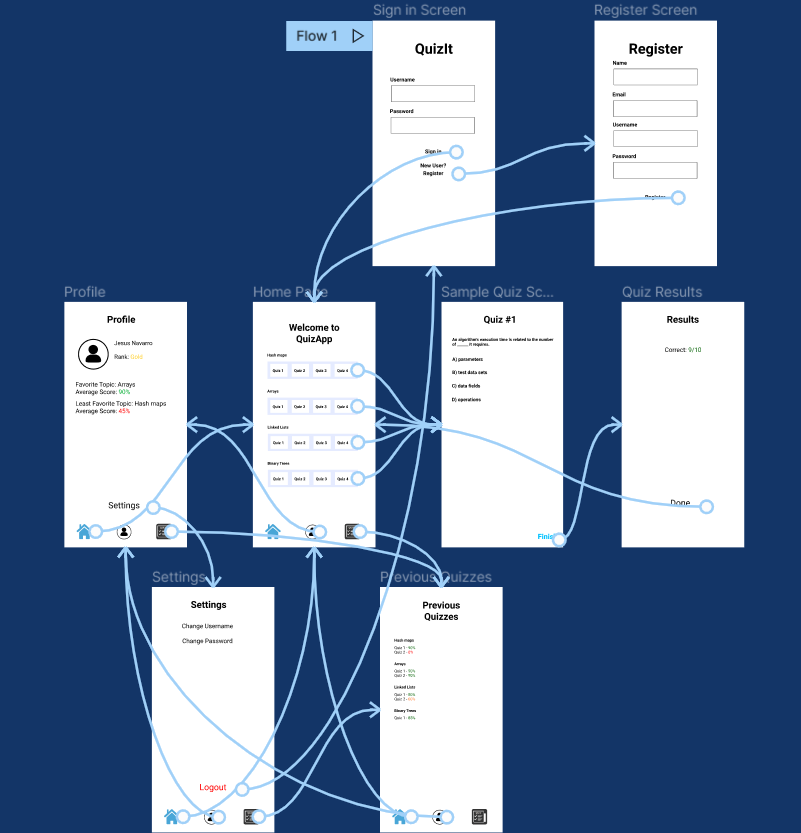
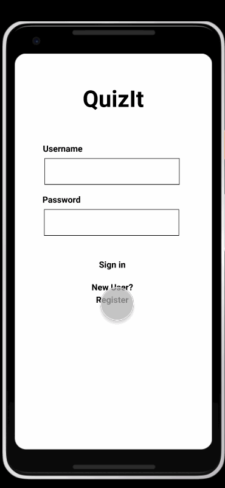
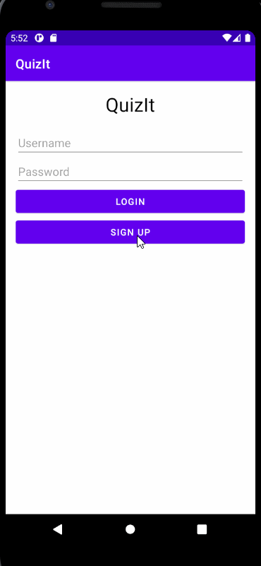

Original App Design Project - README Template
===

# QuizIt

## Table of Contents
1. [Overview](#Overview)
1. [Product Spec](#Product-Spec)
1. [Wireframes](#Wireframes)
2. [Schema](#Schema)

## Overview
### Description
A quiz app that asks you multiple-choice questions related to computer science interview questions. Algorithms and data structures based. (also include a section that displays different languages of code and asks the user to pick out which language it is) (section with bugs in code with error messages that user needs to fix) - All should be multiple-choice, otherwise it would be too difficult.


### App Evaluation
[Evaluation of your app across the following attributes]
- **Category: Education/Entertainment**
- **Mobile:**
- **Story:**
- **Market:**
- **Habit:**
- **Scope:**

## Product Spec

### 1. User Stories (Required and Optional)

**Required Must-have Stories**


- [x] Login/sign up page
- [x] Logout button
- [x] Bottom navigation view - home page with the different quiz types
- [ ] Profile page with settings, 
- [x] Database for the questions. Either need to get an API, or write the questions ourselves.
- [ ] QuizActivity.xml - Should have a question at the top, and 4 buttons representing each multiple choice. Should probably also have an exit button. Point counter gained per quiz. We could probably follow the same pt system as some online quiz thing. 
- [ ] Home.xml - buttons to represent the different quiz types. Username at the top left. Points at the top right. 
- [ ] Profile.xml - profile page with stats of how many they got right/wrong. If we decide to categorize the questions, that should be shown here as well. Logout button. 

**Optional Nice-to-have Stories**

* [fill in your optional user stories here]
* Attractive color scheme
* Page with questions the user recently got wrong.Should clear up once user completes that question correctly ( we could also just make this a separate quiz)  (maybe one more item for the bottom nav)

### 2. Screen Archetypes

* Login/Signup
   * Login and sign up buttons.
   * ...
* List of Quizzes 
   * list of all the quizzes 
   * ...
* Profile
   * Stats: point values, percentages, performance in categories.
   * ...
* Settings
   * Logout
   * Option to reset profile
* Individual quiz
   * The actual quiz with mc
   * ...
* Quiz stats page
   * List of questions and answers as well as the breakdown 
   * ...

### 3. Navigation

**Tab Navigation** (Tab to Screen)

* Bottom view nav - Profile, quiz list, and previous quizzes (quiz history)
* [fill out your second tab]
* [fill out your third tab]

**Flow Navigation** (Screen to Screen)

* Profle to settings page
   * settings button 
   * ...
* Quiz list page to the start of an actual quiz.
   * [list screen navigation here]
   * ...
* Quiz list page to a specific quiz's stats.
   * button next to the quiz that brings user to the stats page of the quiz instead of starting the actual quiz. 
   * ...

## Wireframes
[Add picture of your hand sketched wireframes in this section]


### [Wireframe](https://www.figma.com/file/4rbI4pwN6ke5u0SD7onNtG/QuizApp?node-id=0%3A1)

### [BONUS]
### [Interactive Prototype](https://www.figma.com/proto/4rbI4pwN6ke5u0SD7onNtG/QuizApp?node-id=2%3A2&scaling=scale-down&page-id=0%3A1&starting-point-node-id=2%3A2)


## Schema 
### Models
  Quiz
   | Property      | Type     | Description |
   | ------------- | -------- | ------------|
   | timesTaken    | Number   | number of times a quiz has been taken|
   | averageScore  | Number   | Average score |
   | content       | json object  | json object from the api that holds all data related to the quiz |
   
  User
   | Property      | Type     | Description |
   | ------------- | -------- | ------------|
   | points        | Number   | number of points a user has|
   | quizzes       | String   | list of past 10 quizzes a user has taken and their score corresponding |
   | username        | string     | username|
   | password       | String   | password |
   | email | String   | email |
   | quizCount   | Number   | number of quizzes taken |

### Networking
- Home Feed Screen
   - (Read/Get)Query all quizzes that the user hasn't finished.
   ```
     ParseQuery<Quiz> query = ParseQuery.getQuery<Quiz.class);
     query.findInBackground(new FindCallback<Post>(){
          @Override
          if(e != null){
               Log.e(TAG, "issue with getting quizzes", e);
               return;
          }
          for(Quiz quiz : quizzes){
               Log.i(TAG, "Quiz: " + quiz.getName());
          }
          adapter.clear()
          adapter.addAll(quizzes);
          allPosts.addAll(quizzes);
          swipeRefreshLayout.setRefreshing(false);
      }
     ```
- Previous Quizzes Screen
    - (Read/Get) Querry the title of all the quizzes the user has finished.
    ```
      ParseQuery<Quiz> query = ParseQuery.getQuery<Quiz.class>);
      query.findInBacckground(new FindCallback<Post>(){
           @Overrride
           if(e != null){
                Log.e(TAG, "issue with getting quizzes", e);
                return;
           }
           for(Quiz quiz: quizzes){
                Log.i(TAG, "Quiz: " + quiz.getName());
           }
           adapter.clear();
           adapter.addAll(quizzes);
           allPosts.addAll(quizzes);
           swipeRefreshLayout.setRefreshing(false);
      }
     ``` 
    - (Read/Get) Obtain the score the user got in their first try, second try, etc.
 - Profile Home Screen
    - (Read/Get) Current username.
    - (Read/Get) User's rank.
    - (Read/Get) User's highest grade obtained in a quiz.
    - (Read/Get) User's lowest grade obtained in a quiz.
    - (Read/Get) User's profile picture.
  - Settings Screen
     - (Update/Put) Update user profile picture.
     - (Update/Put) Update user email.
     - (Update/Put) Update user password.
  - Result Screen
     - (Read/Get) Number of questions the user got right.
     - (Read/Get) Number of questions the user got wrong.
- [https://github.com/realVEct0r/leetcode-api]

## Progress

### Milestone 1

